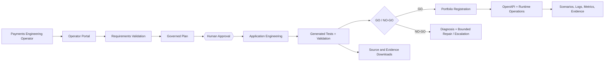

## Canonical current documentation

The repository contains extensive historical phase/evidence material. For the current executable system, use the canonical documentation spine first:

- [Documentation Index](docs/DOCUMENTATION_INDEX.md)
- [System Overview](docs/current_state/SYSTEM_OVERVIEW.md)
- [Current Architecture](docs/current_state/ARCHITECTURE.md)
- [Quality Attributes](docs/current_state/QUALITY_ATTRIBUTES.md)
- [Requirements and Traceability](docs/requirements/REQUIREMENTS_AND_TRACEABILITY.md)
- [Test Strategy and Acceptance](docs/testing/TEST_STRATEGY_AND_ACCEPTANCE.md)
- [Security Architecture and Threat Model](docs/security/SECURITY_ARCHITECTURE_AND_THREAT_MODEL.md)
- [Supply Chain and Dependencies](docs/security/SUPPLY_CHAIN_AND_DEPENDENCIES.md)
- [Operating Model](docs/operations/OPERATING_MODEL.md)
- [Observability and SLO Boundaries](docs/operations/OBSERVABILITY_AND_SLOS.md)
- [Incident and Recovery](docs/operations/INCIDENT_AND_RECOVERY.md)
- [Local and Docker Deployment](docs/deployment/LOCAL_AND_DOCKER_DEPLOYMENT.md)
- [API and Event Contracts](docs/api/API_AND_EVENT_CONTRACTS.md)
- [AI and Agentic Governance](docs/ai/AI_AND_AGENTIC_GOVERNANCE.md)
- [Release Governance](docs/governance/RELEASE_GOVERNANCE.md)

Historical/duplicative documentation is retained for provenance and classified in `docs/documentation/DOCUMENTATION_EVIDENCE_MATRIX.json`; it does not override executable truth or the canonical current documents above.

<!-- generated-by: governed-public-showcase-readiness -->
<!-- exact checkout identity is obtained from Git; governed acceptance is revision-specific -->

# UPI App Factory

**A governed, local-first and evidence-driven Agentic AI application-engineering factory for simulated UPI/payment workflows, with `upi_dispute_resolution` as the current reference profile.**

[](LICENSE)


UPI App Factory turns a fictional payments requirement into a locally runnable, mock-safe Python application with governed planning, explicit approvals, generated source, executed tests, OpenAPI, runtime controls, observability, downloadable evidence and exact delivery provenance.

It is not merely a chatbot or code generator. It treats requirements, agent decisions, application engineering, validation, runtime operations, safety and audit evidence as one controlled workflow.

## Governed functional-delivery evidence

The latest governed functional delivery was accepted at exact commit `c0330ba68a32030e591cb7bcebe3841902789571` with tree `f16171ffbf9937914e8b10779325588e5b54db17`.

- **1514/1514** governed regression tests passed.
- **14/14** mandatory Phase 59/60 engineering gates passed.
- Final human review recorded **P0/P1/P2 = 0/0/0**.
- Exact-commit acceptance and fresh public clean-clone verification passed.
- Governed delivery used an exact non-force `main:main` push with no tag publication.
- The accepted default boundary remained mock/simulated: no real-payment connectivity, production deployment, regulatory approval or certification claim.

These figures are **revision-bound evidence for that exact governed functional delivery**. They are not automatically transferable acceptance evidence for later revisions.

## Why this project stands out

- **One-command public recipient route:** clone the repository and run `./run_factory.sh`.
- **Portal-first engineering workflow:** validate requirements, generate a plan, approve engineering, execute, inspect evidence and operate the generated runtime from the browser.
- **Proof instead of trust:** run IDs, requirement hashes, app/version identities, generated-test results, manifests, logs and SHA-256 evidence are exposed for review.
- **Deterministic-first autonomy:** normal operation does not require an OpenAI API key and defaults to zero live LLM calls.
- **Governed optional intelligence:** prompt comparison, guarded provider integration, retrieval, tool routing, scoped memory and safe feedback adaptation are implemented in the Phase 66 evaluation layer.
- **Safety by construction:** no real payment call, no real secret, no production deployment and no certification claim are permitted by the default workflow.
- **Fail-closed engineering:** missing, stale, tampered or unsafe evidence produces a blocked/NO-GO result rather than an optimistic fallback.
- **Reproducible delivery:** native clean-clone, Docker Compose and exact-commit replay were validated for the latest fully replayed product baseline.
- **Human control at impact boundaries:** paid/networked model use, engineering approval and protected Git delivery actions remain explicit gates.
- **Failure history converted into safeguards:** controller defects, residue, process leaks, Docker opacity and candidate contamination were diagnosed, evidenced and converted into regression controls.

## Primary users

| User | What the factory supports |
|---|---|
| Payments application-engineering operator | Converts a requirement into a governed, test-backed local application. |
| Engineering reviewer | Reviews architecture, source, tests, OpenAPI, logs, metrics and evidence. |
| Product or governance evaluator | Assesses practical usefulness, explainability, safety, traceability and failure handling. |
| Developer or architect | Replays the factory locally, extends approved capabilities and validates changes. |

## Community and responsible use

- [Contributing](CONTRIBUTING.md) — development workflow, validation expectations and pull-request guidance.
- [Security](SECURITY.md) — how to report vulnerabilities without exposing secrets or exploit details.
- [Support](SUPPORT.md) — where to ask usage questions and report reproducible problems.
- [Code of Conduct](CODE_OF_CONDUCT.md) — expectations for respectful technical collaboration.

This project is a local/mock engineering system. Do not use real customer data, payment credentials, production secrets or live payment rails when evaluating it.

## Quick start

### Native one-command route

Prerequisites are Git, a Linux environment with Bash, Python 3.10 or newer with
the standard `venv` module and `pip`, and write access to the clone and selected
state directory. The exact locked dependencies must either be obtainable from
the configured package source or already be installed in a verified compatible
environment. Offline startup cannot acquire missing distributions; prepare a
complete local cache/wheelhouse or a pre-verified exact environment first. The
Docker Compose route below is the existing alternative when the native Python
toolchain is unavailable.

```bash
git clone <repository-url>
cd upi_app_factory
./run_factory.sh
```

Copy `<repository-url>` from GitHub's **Code** menu. The command creates or reuses `.venv`, installs/verifies the recipient dependency set, starts the loopback Operator Portal, waits for `/health`, and prints the verified browser URL.

No OpenAI API key is required for the default deterministic route.

Useful options:

```bash
./run_factory.sh --no-browser
./run_factory.sh --host 127.0.0.1 --port 0 --url-file /tmp/upi-app-factory.url
./run_factory.sh --state-root /tmp/upi-app-factory-state
./stop_factory.sh --state-root /tmp/upi-app-factory-state
```

The explicit state root must follow the factory's state policy: use a repository/worktree location or `/tmp` for isolated acceptance runs.

### Docker Compose route

```bash
docker compose up --build
```

Then open the published loopback Operator Portal. Stop and remove local containers with:

```bash
docker compose down --volumes --remove-orphans
```

See [Environment Specification](docs/handover/ENVIRONMENT_SPEC.md) and [Supported Platforms](config/supported_platforms.yaml).

## Browser workflow

1. Open the Operator Portal URL printed by `./run_factory.sh`.
2. Load [the canonical failed-debit/no-credit sample](examples/requirements/01_upi_failed_debit_no_credit.md) or supply a fictional requirement.
3. Validate the requirement and inspect assumptions, ambiguities and safety boundaries.
4. Create a governed run and generate the engineering plan.
5. Review the plan, app identity, risks and expected evidence.
6. Explicitly approve application engineering.
7. Execute the run and observe progress/events.
8. Inspect generated source, executed generated tests, validation results and evidence.
9. Select the published `app_id` and `version_id` from the portfolio.
10. Approve start, launch the generated runtime, inspect OpenAPI, run scenarios and view logs/metrics/evidence.
11. Download the generated application and evidence bundles.
12. Approve stop and stop the generated runtime.

Detailed guidance: [Portal Guide](docs/handover/PORTAL_GUIDE.md), [Input Contract](docs/operator_portal/input_contract.md) and [Control Contract](docs/operator_portal/control_contract.md).

## Native capability and token economics

Before source generation, the factory now runs a mandatory native capability pre-run that inventories atomic obligations, classifies each one against current executable evidence, and emits improvement artifacts when the factory cannot honestly prove full coverage. The governed CLI entry points are:

```bash
python scripts/run_requirements_capability_prerun.py \
  --requirements-document examples/requirements/01_upi_failed_debit_no_credit.md \
  --application-id upi_dispute_resolution \
  --output-root /tmp/upi-native-prerun

python scripts/run_factory_capability_improvement.py \
  --improvement-requirements /tmp/upi-native-prerun/FACTORY_IMPROVEMENT_REQUIREMENTS.json \
  --improvement-sha256 <sha256> \
  --output-root /tmp/upi-factory-improvement \
  --requirements-document examples/requirements/01_upi_failed_debit_no_credit.md \
  --application-id upi_dispute_resolution
```

Token economics are governed as local configuration and offline decimal calculations rather than hard-coded floating-point estimates. The portal exposes the same local-only distinctions the requirements demand: estimate versus observed versus settled usage, token-category breakdowns including reasoning as a subset of total output, independent raw-token versus economic-budget controls, per-stage/run/application/outcome rollups, rate-card provenance/staleness, and reconciliation posture.

Use the shared CLI surface for summary, validation, normalization, estimation, authorization, settlement, aggregation, reconciliation, and compact evidence export:

```bash
./factoryctl token-economics summary
python scripts/token_economics_cli.py validate-rate-card
python scripts/token_economics_cli.py validate-budget config/token_economics/budgets/default_stage_budget.json
python scripts/token_economics_cli.py normalize /tmp/provider_usage.json
python scripts/token_economics_cli.py estimate /tmp/provider_usage.json --rate-card-id openai-codex-chatgpt-credit-2026-07-28-gpt-5.4
python scripts/token_economics_cli.py authorize /tmp/budget_request.json --budget config/token_economics/budgets/default_stage_budget.json
python scripts/token_economics_cli.py settle /tmp/normalized_usage.json --rate-card-id openai-codex-chatgpt-credit-2026-07-28-gpt-5.4
python scripts/token_economics_cli.py aggregate /tmp/token_economics_ledger.jsonl
python scripts/token_economics_cli.py reconcile /tmp/reconciliation_payload.json
python scripts/token_economics_cli.py compact-report /tmp/token_economics_ledger.jsonl
python -m factory.validators.validate_evidence_ledger
```

The current reference generated runtime (`upi_dispute_resolution`) exposes the bounded canonical failed-debit workflow: create with `POST /v1/disputes`; attach the required `switch_failure`, `core_ledger`, and `customer_statement` evidence; investigate with `POST /v1/disputes/{id}/investigate`; classify with `POST /v1/disputes/{id}/classify`; request and record human review through `POST /v1/disputes/{id}/human-review` and `POST /v1/disputes/{id}/review-decisions`; record the approved outcome with `POST /v1/disputes/{id}/disposition`; close with `POST /v1/disputes/{id}/close`; and inspect `GET /v1/disputes/{id}/history` plus `GET /v1/disputes/{id}/audit-integrity`. Every state-changing request after creation requires a positive, matching `expected_version` guard. The runtime is deterministic-first and mock-only.

`/investigation`, `/resolution`, and `/timeline` are deprecated, schema-hidden compatibility aliases for `/investigate`, `/classify`, and `/history`. The compatibility `/resolution` route accepts only `finalize_action=propose_only` and delegates to classification; it cannot record a disposition, finalize, or close a case. New integrations must use the canonical routes above.

## Independent generated-application handover

The current reference generated application (`upi_dispute_resolution`) carries its own exact clean-room dependency contract.

```bash
cd workspace/factory_generated/upi_dispute_resolution/generated_application
./scripts/bootstrap_cleanroom.sh
.venv/bin/python scripts/validate_dependency_contract.py
.venv/bin/python -m pytest -q app/tests
./scripts/start_local.sh
```

The source bundle owns `requirements-bootstrap.lock`, `requirements.lock`, `dependency_contract.json`, and `scripts/bootstrap_cleanroom.sh`. It remains mock-only and does not claim wheel packaging, production deployment, certification, or real-payment connectivity.

See [Generated Application Handover](docs/handover/GENERATED_APPLICATION_HANDOVER.md) and [Supply Chain and Dependencies](docs/security/SUPPLY_CHAIN_AND_DEPENDENCIES.md).

## What the factory produces

A governed run can produce:

- a normalized requirement package and SHA-256 identity;
- assumptions, ambiguities, risks and traceability;
- an application-engineering plan and approval record;
- Python/FastAPI source with a non-default-safe application namespace;
- domain, application, infrastructure and API layers;
- generated tests **and evidence that those tests were executed**;
- generated OpenAPI and route inventory;
- runtime start/restart/stop controls and scenario execution;
- structured logs, latency, metrics and trace/correlation identifiers;
- source and evidence ZIP bundles with path-safety and checksums;
- immutable portfolio registration containing `app_id`, `version_id`, run identity and requirements identity.

## Core capability map

| Capability | Implementation posture |
|---|---|
| Requirements engineering | Structured and natural-language intake, validation, ambiguity handling, assumptions, constraints and traceability. |
| Planning and orchestration | Multi-step validation → planning → approval → engineering → validation → diagnosis → bounded repair → review gate. |
| Application engineering | Deterministic generators and governed agentic paths produce a mock-safe locally runnable application. |
| Generated-test evidence | Generated tests execute before GO; command, exit status, counts, output/hashes and identities are retained. |
| Knowledge and retrieval | Phase 66 approved corpus, stable chunks, embeddings, cosine retrieval, citations, RAG/no-RAG evaluation and poisoning rejection. |
| Tool usage | Bounded routing among deterministic assertions, fake/live provider paths, retrieval and human review; rejected tools and reasons are recorded. |
| Memory and context | Phase 66 session/workflow/evidence scopes with retention, expiry, reset, run isolation and sensitive-memory rejection. |
| Adaptive behaviour | Safe reviewer feedback can improve guidance; approval bypass, live-bank access and sensitive retention feedback are rejected. |
| Runtime operations | Portfolio selection, approval-gated start/restart/stop, OpenAPI discovery, scenarios, evidence, logs and metrics. |
| Deployment readiness | Native one-command route, Dockerfile, Docker Compose, health gating, graceful stop and reproducible state contracts. |
| Governance | Mock-only boundary, deterministic-first policy, evidence manifests, hashes, human gates and protected-action controls. |

## Architecture



The default route is local and deterministic. Optional LLM and embedding integrations are policy- and credential-gated and are not required to run the factory.

## AI-agent evaluation layer (Phase 66)

The repository includes a bounded rubric-alignment subsystem under [`src/upi_factory/rubric_alignment/`](src/upi_factory/rubric_alignment/) with:

- a Python agent/provider protocol and deterministic fake provider;
- multiple prompt strategies, prompt hashes and structured comparison;
- an optional guarded OpenAI Responses/Embeddings path;
- approved-corpus retrieval with citations and retrieval-quality metrics;
- a tool router that records considered, selected and rejected tools;
- scoped memory with reset, expiry, run isolation and sensitive-data rejection;
- safe feedback adaptation with before/after evidence;
- monitoring, refusal, poisoning, schema-failure and live-gate tests.

Start with:

- [Phase 66 Problem Framing](docs/capstone/phase66/problem_framing.md)
- [Phase 66 Architecture](docs/capstone/phase66/architecture.md)
- [Phase 66 Evaluation Summary](docs/capstone/phase66/phase66_evaluation_summary.md)
- [Rubric Evidence Matrix](docs/capstone/phase66/rubric_evidence_matrix.md)

Truthful scope: the retrieval corpus is intentionally small and approved; the vector index is JSONL-based; memory is a local/in-memory demonstration; tool routing is bounded rather than an unrestricted executable marketplace.

## Reliability and evidence

Acceptance is bound to the exact checked-out Git revision rather than a self-staling SHA embedded in this file.

```bash
git rev-parse HEAD
git rev-parse HEAD^{tree}
git rev-parse HEAD^
```

For the revision you are evaluating, use those identities together with the repository's Governed CI and delivery evidence. A green run on another revision is not transferable acceptance evidence.

| Gate | Current result |
|---|---:|
| Pull-request Governed CI | 7/7 jobs passed |
| Push-to-main Governed CI | 7/7 jobs passed |
| Full regression | Passed |
| Ruff | Passed |
| MyPy | Passed |
| Docker platform contract | Passed |
| Public clone hygiene | Passed |
| Governance policy | Passed |
| Generated app clean-room bootstrap | Passed |
| Dependency tamper rejection | Passed |
| Vulnerability audit | Passed |
| CycloneDX SBOM | Passed |
| Independent ZIP/download replay | Passed |
| Fresh public clone exact identity | Passed |

No RC tag, GitHub release, production deployment or certification claim is implied by this engineering closure.

See [Operations and Acceptance](docs/current_state/OPERATIONS_AND_ACCEPTANCE.md).

## Safety boundaries and non-claims

- No real payment, bank, PSP, UPI switch, NPCI or RBI call is permitted by the default workflow.
- External ecosystems are mocked or simulated.
- Real secrets and real customer PII must not be used.
- Live LLM/embedding calls require explicit approval and credentials.
- Generated outputs are **certification-ready-not-certified**.
- The project is not production-deployed and does not claim production readiness.
- The project is not RBI-approved, NPCI-approved, bank-certified, legally sufficient or authorised to move real money.
- Human review remains mandatory for ambiguity, policy conflict, paid/networked calls and protected delivery actions.

## Repository map

| Path | Purpose |
|---|---|
| [`factory/`](factory/) | Factory services, governance-critical components and Operator Portal. |
| [`app/`](app/) | Local reference application/runtime surfaces. |
| [`src/upi_factory/rubric_alignment/`](src/upi_factory/rubric_alignment/) | Phase 66 AI-agent evaluation layer. |
| [`scripts/`](scripts/) | Deterministic builders, validators, E2E and governed automation. |
| [`tests/`](tests/) | Unit, integration, safety, scenario and regression tests. |
| [`docs/`](docs/) | Architecture, operations, governance, handover and evaluator documentation. |
| [`examples/requirements/`](examples/requirements/) | Canonical fictional requirement examples. |
| [`policies/`](policies/) | Path neutrality, tracked-workspace and governance policies. |
| [`factory_governance/`](factory_governance/) | Baseline provenance and governed delivery evidence. |
| [`workspace/factory_generated/`](workspace/factory_generated/) | Tracked reference generated-application and lifecycle evidence. |

## Useful commands

```bash
# Canonical public startup
./run_factory.sh

# Headless startup and explicit state
./run_factory.sh --no-browser --state-root /tmp/upi-app-factory-state

# Stop the portal
./stop_factory.sh --state-root /tmp/upi-app-factory-state

# Public-clone readiness validation
python scripts/validate_public_clone_readiness.py --repo . --license Apache-2.0

# Automated public recipient E2E against a running portal
.venv/bin/python scripts/run_public_clean_clone_recipient_e2e.py \
  --base-url http://127.0.0.1:<port> \
  --requirements examples/requirements/01_upi_failed_debit_no_credit.md \
  --evidence-root /tmp/upi-recipient-e2e \
  --json-output /tmp/upi-recipient-e2e/result.json

# Repository Makefile validation routes
make validate
make validate-public-clone

# Makefile reference-application route (not the Operator Portal)
make run

# Static quality and complete regression
.venv/bin/python -m ruff check app factory tests
.venv/bin/python -m mypy app factory
.venv/bin/python -m pytest -q

# Docker route
docker compose config
docker compose up --build
```

## Documentation

- [Complete Factory Guide](docs/factory/UPI_APP_FACTORY_COMPLETE_GUIDE.html)
- [Quick Start](docs/handover/QUICKSTART.md)
- [Portal Guide](docs/handover/PORTAL_GUIDE.md)
- [Command Reference](docs/handover/COMMAND_REFERENCE.md)
- [Environment Specification](docs/handover/ENVIRONMENT_SPEC.md)
- [Troubleshooting](docs/handover/TROUBLESHOOTING.md)
- [Release Package Specification](docs/handover/RELEASE_PACKAGE_SPEC.md)

## Current limitations and roadmap

Confirmed limitations:

- local and Docker-deployable, but not production-deployed;
- no real payment ecosystem connectivity;
- no external legal, regulatory, security, privacy or scheme certification;
- Phase 66 memory is not a durable multi-user memory service;
- Phase 66 tool routing is intentionally bounded;
- retrieval uses a small approved corpus and is not a production-scale knowledge platform;
- broader independent accessibility, performance, browser-compatibility and regulatory review remain future work.

Recommended next improvements:

1. Seal corrected post-merge manual browser acceptance when not already recorded.
2. Add signed artifact/provenance verification.
3. Expand the approved retrieval corpus and independent poisoning/relevance evaluation.
4. Add an encrypted tenant-scoped persistent memory service only when a real reviewer workflow requires it.
5. Expose reviewer feedback/adaptation history with approval and rollback in the portal.
6. Obtain independent domain, security, privacy, legal and regulatory review before any real-world payment use.

## Governance for contributors

- Prefer deterministic mechanisms before LLM use.
- Use fictional and synthetic data only.
- Preserve mock-only and certification-ready-not-certified boundaries.
- Do not weaken tests, skip failures or fabricate evidence.
- Keep generated/runtime state within approved worktree or `/tmp` boundaries for isolated runs.
- Require explicit human approval for paid/networked calls and protected Git delivery actions.
- Validate changes in isolated clones and preserve evidence for the exact commit under review.

See [`AGENTS.md`](AGENTS.md) for repository-governed engineering instructions.

## License

Licensed under the [Apache License 2.0](LICENSE). See [NOTICE](NOTICE) for attribution and notices.

## Supported platform boundary

Supported recipient routes are native Ubuntu/Linux and Docker/Compose on Linux, macOS, and Windows Docker Desktop.

The following wording is retained from validator-proven repository documentation solely to preserve conservative platform non-claims:

- Do not use this route as evidence of native Windows or native macOS support

These are non-claims. They do not assert native Windows or native macOS validation, production readiness, deployment, certification, or regulatory approval.
## Historical compatibility evidence

The following machine-readable markers are retained solely so historical, deterministic validators can replay earlier governed milestones. They do **not** describe the current release status, do not create a Git tag, and do not claim certification or production deployment.

- `Phase 45` — historical final-v1 candidate consolidation milestone.
- `certification_ready_not_certified` — historical underscore-form boundary token; current posture remains certification-ready-not-certified.
- `local-readiness` — historical local-readiness milestone marker.
- `v1.0.0-local-governed-upi-factory-candidate` — historical local candidate identifier; no current tag or release claim.

Current authoritative state remains the governed public-clean-clone factory described above, with real payment calls disabled, mock/simulated integrations only, and no official certification claim.
