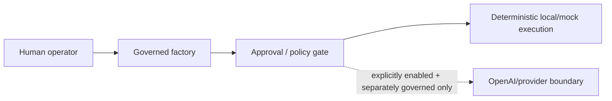

# AI and Agentic Governance

> **Status:** Canonical current-state documentation 
> **Purpose:** Describe the current LLM/agent boundary, human oversight and AI-risk controls without implying live provider use. 
> **Audience:** AI architects, developers, security reviewers, operators, product owners and governance reviewers 
> **Authority:** implementation, tests, runtime/configuration contracts, generated artifacts and governed evidence at the checked-out revision. This document does not override executable behavior.

## Standards and practice alignment

- NIST AI RMF 1.0; NIST AI 600-1; NIST SP 800-218A
- NIST SP 800-218 SSDF 1.1; OWASP ASVS 5.0.0 verification reference

Alignment is an engineering documentation practice, **not** a claim of certification, formal conformity assessment, production approval, or regulatory approval.

## Current AI boundary

The repository contains agentic/LLM integration capability, including an OpenAI adapter boundary, but accepted local routes assert LLM-off flags. No OpenAI API key is required for deterministic default operation.

## Human oversight

Protected planning/approval/engineering/release decisions require explicit human authorization. Autonomous repair is bounded and stops when a change would alter product semantics, add capabilities/dependencies, weaken controls or cross a protected boundary.

## NIST AI RMF-oriented view

- **Govern:** protected actions, evidence, accountable human approvals and non-claims.
- **Map:** local/mock dispute-resolution context, external provider boundary, generated runtime, operator and recipient.
- **Measure:** deterministic tests/validators and scenario/evidence outcomes; no unsupported model-quality benchmark claim.
- **Manage:** default-off live LLM, bounded repair, fail-closed escalation and evidence preservation.

## Generative-AI security concerns

Relevant concerns include prompt/tool injection, unsafe tool authority, secret leakage, retrieval/data poisoning, excessive autonomy, provider/data privacy and misleading generated claims. Controls apply only to actually enabled AI functionality.

## Non-claims

No live LLM call is required for acceptance and no model/provider performance or NIST compliance certification is claimed.
