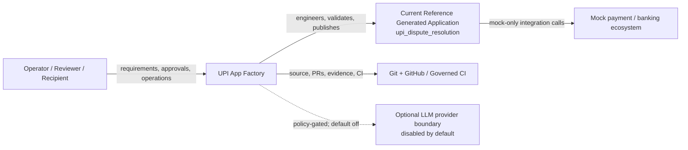
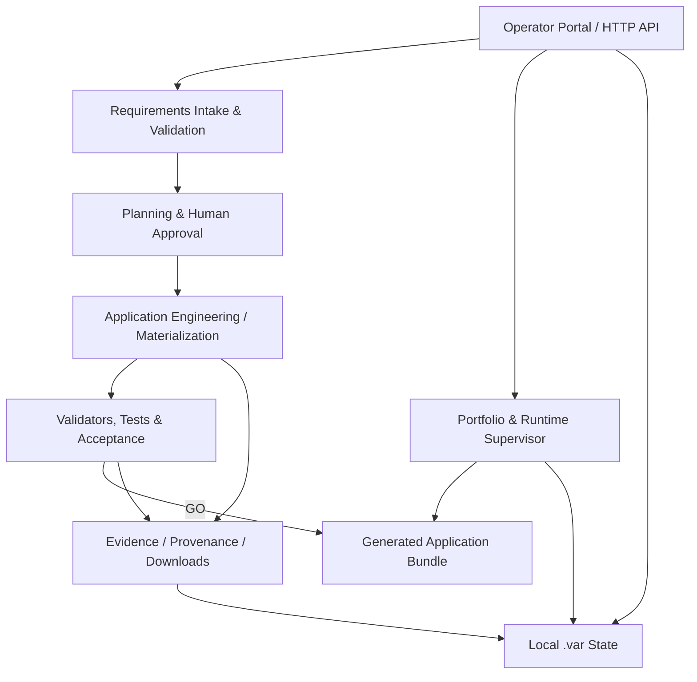
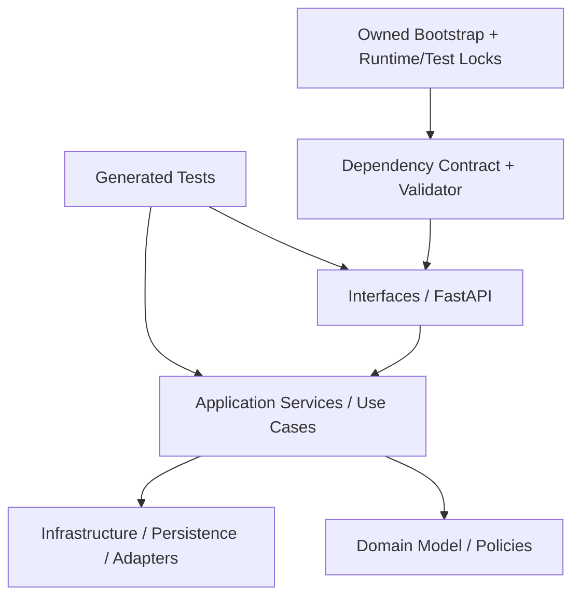
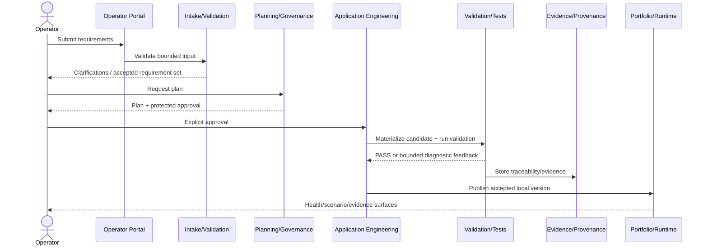
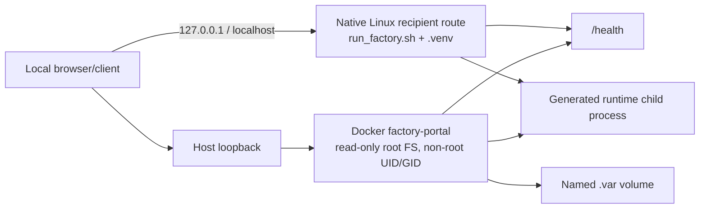
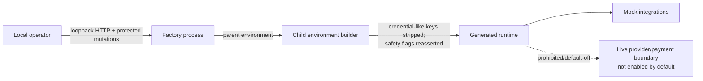
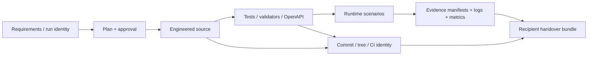
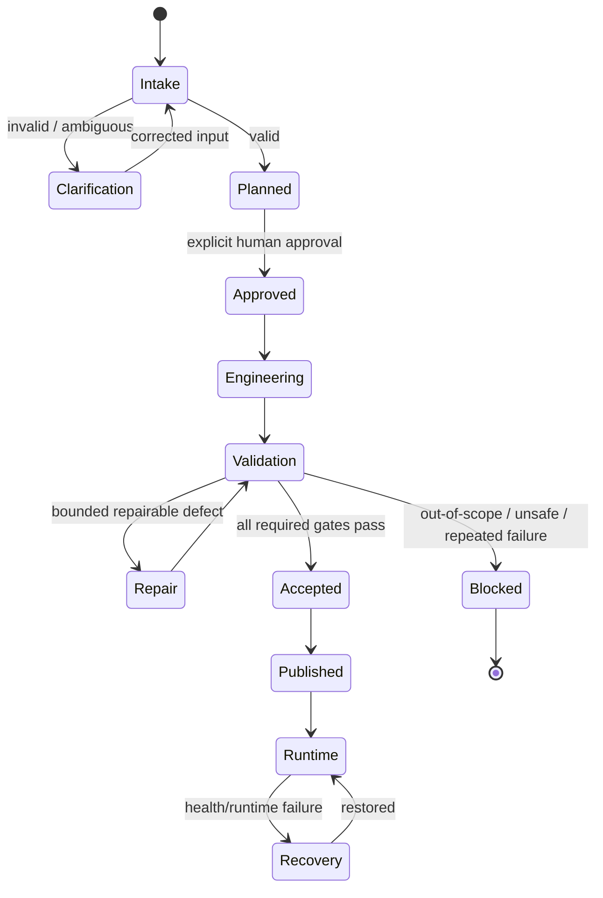

# Current Architecture

> **Status:** Canonical current-state documentation
> **Purpose:** Describe the current factory and engineered-application architecture using stakeholder-oriented views derived from executable truth.
> **Audience:** architects, principal engineers, developers, security reviewers, SRE/operators, testers and recipients
> **Authority:** implementation, tests, runtime/configuration contracts, generated artifacts and governed evidence at the checked-out revision. This document does not override executable behavior.

## Standards and practice alignment

- ISO/IEC/IEEE 42010:2022; C4/arc42 pragmatic modeling practices
- ISO/IEC 25010:2023
- NIST SP 800-218 SSDF 1.1; OWASP ASVS 5.0.0 verification reference

Alignment is an engineering documentation practice, **not** a claim of certification, formal conformity assessment, production approval, or regulatory approval.

## Architectural goals and constraints

- Lightweight and local-first; no Kubernetes requirement.
- Deterministic/mock-safe acceptance route.
- Explicit human approval at protected engineering/release boundaries.
- Every `CURRENT_AND_VERIFIED` generated application profile is independently reproducible from its source bundle and owned locks/contracts.
- External payment/provider behavior is mocked or disabled in accepted default operation.
- Architecture documentation distinguishes current executable product code from tests, tooling and historical workspace copies.
- API documentation uses the semantically normalized **123** authoritative unique route keys rather than the raw AST count of 312.

## View 1 — system context

## View 2 — factory containers / major subsystems

## View 3 — current reference generated application structure

Current reference generated application (`upi_dispute_resolution`) layer evidence: `{"application": 5, "control_plane": 1, "disputes": 4, "domain": 5, "infrastructure": 9, "interfaces": 3, "observability": 3, "runtime.py": 1, "security": 3, "tests": 14, "upi_dispute_app": 15}`.

## View 4 — governed application engineering flow

## View 5 — deployment topology

The Docker route is a container portability route. **Do not use this route as evidence of native Windows or native macOS support.**

## View 6 — security and trust boundaries

## View 7 — evidence and provenance flow

## View 8 — failure and recovery state model

## Key source-truth references

- The native recipient launcher refuses non-loopback host values. — `run_factory.sh`:66
- The native recipient launcher explicitly disables real payment calls. — `run_factory.sh`:186
- The native recipient launcher explicitly disables factory LLM execution by default. — `run_factory.sh`:187
- The Docker factory-portal service runs with a read-only root filesystem. — `compose.yaml`:8
- Docker publishes the factory portal on loopback only. — `compose.yaml`:25
- Docker publishes the factory portal on loopback only. — `compose.yaml`:32
- Docker defines an explicit healthcheck against the factory health endpoint. — `compose.yaml`:28
- Docker explicitly disables real payment calls. — `compose.yaml`:20
- Docker explicitly disables real payment calls. — `compose.yaml`:21
- Docker explicitly disables factory LLM execution. — `compose.yaml`:18
- Docker explicitly disables factory LLM execution. — `compose.yaml`:19
- Generated runtime process environments are constructed by a dedicated boundary function. — `factory/application_engineering/portfolio.py`:118
- Generated runtime environment handling explicitly controls real-payment safety state. — `factory/application_engineering/portfolio.py`:132

## Architectural decisions and trade-offs

- **Local-first over platform complexity:** keeps the factory lightweight and reproducible; production orchestration is deliberately not claimed.
- **Exact dependency closure over permissive floating installs:** reduces recipient drift at the cost of deliberate lock maintenance.
- **Human approval over unconstrained autonomy:** protected actions require explicit governance rather than silent agent escalation.
- **Generated source bundle over opaque binary packaging:** favors inspectability and clean-room reproducibility.
- **Mock/provider boundaries over live external calls during acceptance:** preserves safety and determinism.
- **Git/evidence identity over narrative status claims:** acceptance is tied to exact artifacts and executable checks.

Historical ADRs remain evidence of how the architecture evolved; they do not override this current-state view.
