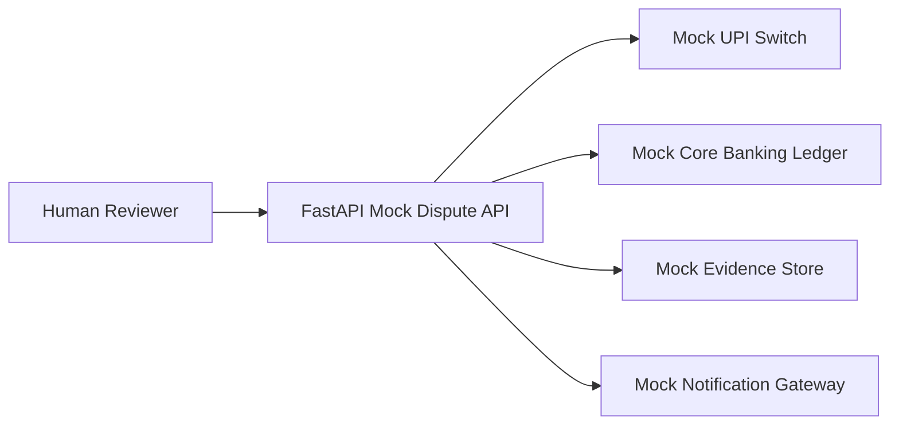
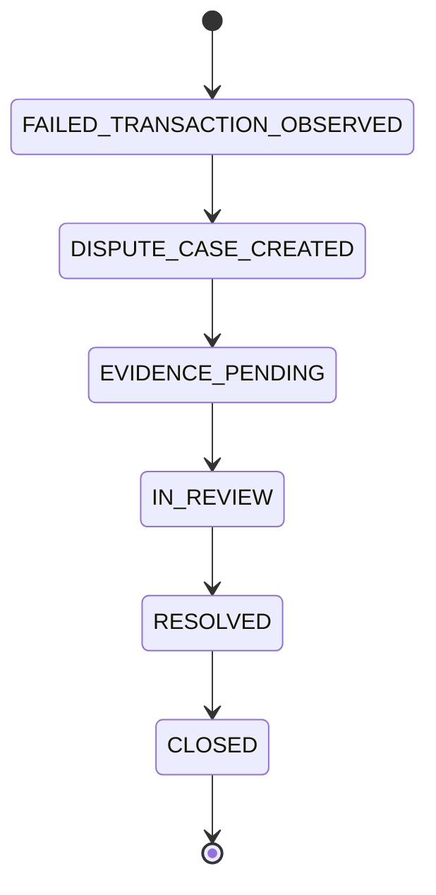

# Phase 3 Diagrams

Evidence labels: MISSING_OFFICIAL_SOURCE, SYNTHETIC_ENTERPRISE_WORKFLOW_MODEL, MOCK_BOUNDARY, SYNTHETIC_DATA

```mermaid
flowchart LR
  Reviewer[Human Reviewer] --> API[FastAPI Mock Dispute API]
  API --> Switch[Mock UPI Switch]
  API --> Ledger[Mock Core Banking Ledger]
  API --> Store[Mock Evidence Store]
  API --> Notify[Mock Notification Gateway]
```

```mermaid
stateDiagram-v2
  [*] --> FAILED_TRANSACTION_OBSERVED
  FAILED_TRANSACTION_OBSERVED --> DISPUTE_CASE_CREATED
  DISPUTE_CASE_CREATED --> EVIDENCE_PENDING
  EVIDENCE_PENDING --> IN_REVIEW
  IN_REVIEW --> RESOLVED
  RESOLVED --> CLOSED
  CLOSED --> [*]
```
