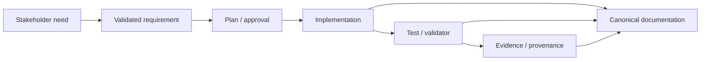

# Requirements and Traceability

> **Status:** Canonical current-state documentation 
> **Purpose:** Explain how requirements become governed engineering work and how implementation/test/evidence traceability is maintained. 
> **Audience:** product owners, architects, developers, testers, auditors and reviewers 
> **Authority:** implementation, tests, runtime/configuration contracts, generated artifacts and governed evidence at the checked-out revision. This document does not override executable behavior.

## Standards and practice alignment

- ISO/IEC/IEEE 29148:2018
- ISO/IEC 25010:2023
- ISO/IEC/IEEE 15289:2019

Alignment is an engineering documentation practice, **not** a claim of certification, formal conformity assessment, production approval, or regulatory approval.

## Requirements model

The factory treats requirements as governed input rather than informal prompting. Requirements are validated before planning; protected execution requires explicit approval; engineered outputs are accepted only after validation/evidence gates.

Observed source-level requirement-like identifiers: **2559**. These are traceability clues, not an assertion that every observed token is a formal ISO/IEC/IEEE 29148 requirement.

## Requirement categories

- Business/use-case requirements
- Functional behavior and API/event contracts
- Quality attributes
- Security and privacy boundaries
- Operational/observability requirements
- Dependency/supply-chain constraints
- Governance and protected-action constraints
- Handover/reproducibility requirements

## Traceability chain

## Requirement quality rules

A current requirement should be necessary, bounded, sufficiently unambiguous to validate, traceable to its source/owner, testable where practical, and explicit about safety/quality constraints. Ambiguity is resolved before protected engineering actions rather than silently guessed.

## Acceptance

Documentation assertions never substitute for executable evidence. Relevant implementation/test/evidence gates must pass at the exact candidate revision.
