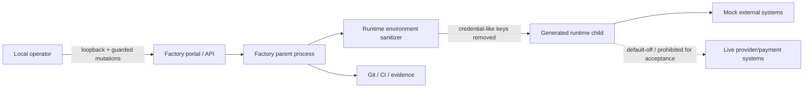

# Security Architecture and Threat Model

> **Status:** Canonical current-state documentation 
> **Purpose:** Describe current assets, trust boundaries, threats, controls and verification without overstating production or regulatory posture. 
> **Audience:** security engineers, architects, developers, reviewers, operators and auditors 
> **Authority:** implementation, tests, runtime/configuration contracts, generated artifacts and governed evidence at the checked-out revision. This document does not override executable behavior.

## Standards and practice alignment

- NIST SP 800-218 SSDF 1.1; OWASP ASVS 5.0.0 verification reference
- ISO/IEC/IEEE 42010:2022; C4/arc42 pragmatic modeling practices
- SLSA 1.2 concepts; CycloneDX/SPDX SBOM concepts without level/certification claims

Alignment is an engineering documentation practice, **not** a claim of certification, formal conformity assessment, production approval, or regulatory approval.

## Assets and sensitive data

Protected concerns include source/evidence integrity, approvals, generated artifacts, runtime state, parent-environment credentials, operator actions, dependency locks and local exports. Acceptance uses fictional/synthetic business data and does not require live payment credentials.

## Trust boundaries

## Threat and control table

| Threat / abuse case | Current control | Verification source |
|---|---|---|
| Accidental network exposure | Native host restricted to loopback; Docker host publication uses `127.0.0.1`. | `run_factory.sh`, `compose.yaml`, tests |
| Parent secret leakage | Dedicated child-environment construction strips credential-like variables. | `factory/application_engineering/portfolio.py`, security tests |
| Real payment escape | Real-payment flags explicitly disabled/reasserted. | launcher, Compose, runtime code/tests |
| Unapproved live LLM/provider activity | LLM flags default off; provider execution remains policy-gated. | launcher, Compose, adapters/policy tests |
| Dependency substitution/drift | Exact locks, environment closure verification, `pip check`. | locks, launcher, dependency contract |
| Vulnerable/unknown third-party closure | Vulnerability audit support plus CycloneDX SBOM evidence. | supply-chain evidence |
| Duplicate/unsafe UI mutation | Shared in-flight action guards and protected approvals. | portal control contract/tests |
| Evidence/release tampering | SHA-256 manifests, exact commit/tree binding, Governed CI. | evidence/release governance |

## Identity, access and authorization

The accepted factory is local-first; protected actions require explicit human authorization. This does not claim enterprise IAM/RBAC, production SSO or internet-facing authentication.

## Secrets and input/output safety

Generated runtime environment construction strips credential-like variables such as token, secret, password, API/private/access keys and credentials, while safety configuration is reasserted. Log redaction is recursive and bounded. Secrets must not be copied into documentation/evidence.

## Supply chain

The security model includes the software supply chain as an explicit trust and integrity concern. The factory recipient route uses exact bootstrap and recipient dependency locks; the generated application separately owns its clean-room bootstrap/runtime-test locks and dependency contract. Qualification uses dependency-closure checks, `pip check`, vulnerability-audit support, SBOM evidence, exact source/tree identities and governed handoff checksums.

The detailed dependency, SBOM and provenance model is maintained in [Supply Chain and Dependencies](SUPPLY_CHAIN_AND_DEPENDENCIES.md). SLSA/CycloneDX/SPDX concepts are used as engineering references only; no SLSA level or certification is claimed.

## Incident boundary

A security finding requiring product semantic change, live-provider enablement, security weakening or unknown secret exposure is outside autonomous documentation repair and requires human engineering review.

## Source-truth references

- The native recipient launcher refuses non-loopback host values. — `run_factory.sh`:66
- The native recipient launcher explicitly disables real payment calls. — `run_factory.sh`:186
- The native recipient launcher explicitly disables factory LLM execution by default. — `run_factory.sh`:187
- The Docker factory-portal service runs with a read-only root filesystem. — `compose.yaml`:8
- Docker publishes the factory portal on loopback only. — `compose.yaml`:25
- Docker publishes the factory portal on loopback only. — `compose.yaml`:32
- Docker explicitly disables real payment calls. — `compose.yaml`:20
- Docker explicitly disables real payment calls. — `compose.yaml`:21
- Docker explicitly disables factory LLM execution. — `compose.yaml`:18
- Docker explicitly disables factory LLM execution. — `compose.yaml`:19
- Generated runtime process environments are constructed by a dedicated boundary function. — `factory/application_engineering/portfolio.py`:118
- Generated runtime environment construction contains credential-like variable filtering logic. — `factory/application_engineering/portfolio.py`:29
- Generated runtime environment construction contains credential-like variable filtering logic. — `factory/application_engineering/portfolio.py`:30
- Generated runtime environment handling explicitly controls real-payment safety state. — `factory/application_engineering/portfolio.py`:132

## Non-claims

This is a current local/mock threat model, not a penetration-test report, production certification, PCI/UPI regulatory certification or OWASP/NIST conformity certificate.
